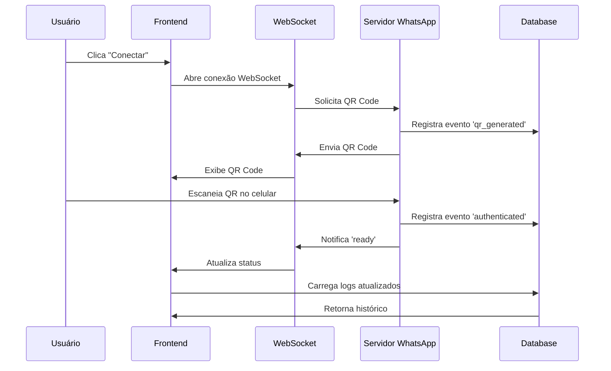

# Sistema WhatsApp Web - Multi-Tenant

## 📋 Visão Geral

Este sistema permite que cada empresa (tenant) gerencie sua própria conexão WhatsApp através da interface web, sem necessidade de configuração local ou acesso ao servidor.

## 🌟 Funcionalidades

### Para Cada Empresa

1. **Página de Conexão Individual**: Cada tenant tem sua própria página em `/whatsapp-connection`
2. **QR Code na Web**: O QR code é exibido diretamente na página web
3. **Logs de Conexão**: Histórico completo de eventos de conexão
4. **Status em Tempo Real**: Visualização do status de conexão em tempo real
5. **Isolamento Total**: As conexões são completamente isoladas entre empresas

### Eventos Monitorados

O sistema registra automaticamente os seguintes eventos:

- ✅ `qr_generated`: Quando um novo QR code é gerado
- 🟢 `ready`: Quando o WhatsApp é conectado com sucesso
- 📱 `authenticated`: Quando a autenticação é concluída
- 🔴 `disconnected`: Quando o WhatsApp é desconectado
- ❌ `error`: Quando ocorre um erro na conexão

## 🚀 Como Usar

### Para Usuários (Administradores de Empresa)

1. **Acesse o Sistema**
   - Entre no sistema usando suas credenciais
   - No menu lateral, clique em "Conexão WhatsApp"

2. **Conectar WhatsApp**
   - Clique no botão "Conectar WhatsApp"
   - Aguarde o QR code aparecer na tela
   - Abra o WhatsApp no seu celular
   - Vá em: Mais opções → Aparelhos conectados → Conectar um aparelho
   - Escaneie o QR code exibido na tela

3. **Verificar Status**
   - O badge no topo mostra se está conectado ou desconectado
   - Verde = Conectado
   - Vermelho = Desconectado

4. **Visualizar Logs**
   - A seção "Log de Conexões" mostra todo o histórico
   - Atualize clicando no botão "Atualizar"

5. **Desconectar**
   - Quando conectado, use o botão "Desconectar WhatsApp"
   - Isso remove a conexão deste tenant

## 🗄️ Estrutura do Banco de Dados

### Tabela: whatsapp_connection_logs

```sql
CREATE TABLE whatsapp_connection_logs (
  id uuid PRIMARY KEY,
  tenant_id uuid NOT NULL,
  event_type text NOT NULL,
  message text,
  metadata jsonb,
  created_at timestamp with time zone
);
```

**Colunas:**
- `id`: Identificador único do log
- `tenant_id`: ID da empresa (relacionado à tabela tenants)
- `event_type`: Tipo de evento (qr_generated, ready, disconnected, error)
- `message`: Mensagem descritiva do evento
- `metadata`: Dados adicionais em JSON
- `created_at`: Data e hora do evento

## 🔐 Segurança

### Row Level Security (RLS)

O sistema implementa RLS para garantir que:

1. **Isolamento de Dados**: Cada empresa vê apenas seus próprios logs
2. **Super Admin**: Pode visualizar todos os logs de todas as empresas
3. **Inserção Pública**: O sistema pode inserir logs automaticamente
4. **Sem Modificação**: Logs não podem ser editados ou deletados por usuários

### Políticas RLS

```sql
-- Super admin pode ver todos os logs
CREATE POLICY "Super admin can view all connection logs"
  ON whatsapp_connection_logs FOR SELECT
  USING (is_super_admin());

-- Tenant vê apenas seus logs
CREATE POLICY "Tenant users can view their connection logs"
  ON whatsapp_connection_logs FOR SELECT
  USING (tenant_id = get_current_tenant_id());

-- Sistema pode inserir logs
CREATE POLICY "System can insert connection logs"
  ON whatsapp_connection_logs FOR INSERT
  WITH CHECK (true);
```

## 🌐 Arquitetura do Sistema

### Frontend (React)

**Página:** `src/pages/WhatsAppConnection.tsx`

Funcionalidades:
- Exibição de QR code via WebSocket
- Monitoramento de status em tempo real
- Visualização de logs
- Controles de conexão/desconexão

**Rota:** `/whatsapp-connection` (protegida por autenticação)

### Backend (Node.js - Servidor WhatsApp)

O servidor Node.js precisa implementar:

1. **WebSocket por Tenant**: `/ws/:tenantId`
   - Envia QR code em tempo real
   - Notifica eventos de conexão
   - Mantém conexão ativa durante autenticação

2. **API REST**:
   - `GET /status/:tenantId` - Status da conexão
   - `POST /disconnect/:tenantId` - Desconectar
   - `POST /send` - Enviar mensagens

3. **Registro de Logs**:
   ```javascript
   await supabase.from('whatsapp_connection_logs').insert({
     tenant_id: tenantId,
     event_type: 'qr_generated',
     message: 'QR Code gerado',
     metadata: { /* dados extras */ }
   });
   ```

## 📝 Exemplo de Implementação Backend

### WebSocket Handler

```javascript
// Exemplo de como o servidor deve implementar WebSocket
app.ws('/ws/:tenantId', (ws, req) => {
  const tenantId = req.params.tenantId;
  
  // Criar/obter cliente WhatsApp para este tenant
  const client = getTenantClient(tenantId);
  
  // Evento: QR Code gerado
  client.on('qr', async (qr) => {
    // Enviar QR para o frontend
    ws.send(JSON.stringify({
      type: 'qr',
      qr: qr
    }));
    
    // Registrar log
    await logEvent(tenantId, 'qr_generated', 'QR Code gerado');
  });
  
  // Evento: Autenticado
  client.on('authenticated', async () => {
    await logEvent(tenantId, 'authenticated', 'Autenticação concluída');
  });
  
  // Evento: Pronto
  client.on('ready', async () => {
    ws.send(JSON.stringify({
      type: 'ready',
      message: 'WhatsApp conectado'
    }));
    
    await logEvent(tenantId, 'ready', 'WhatsApp conectado com sucesso');
  });
  
  // Evento: Desconectado
  client.on('disconnected', async (reason) => {
    await logEvent(tenantId, 'disconnected', `Desconectado: ${reason}`);
  });
});

// Função auxiliar para registrar eventos
async function logEvent(tenantId, eventType, message, metadata = null) {
  await supabase.from('whatsapp_connection_logs').insert({
    tenant_id: tenantId,
    event_type: eventType,
    message: message,
    metadata: metadata
  });
}
```

## 🔧 Configuração do Servidor

### Dependências Necessárias

```json
{
  "dependencies": {
    "whatsapp-web.js": "^1.23.0",
    "express": "^4.18.0",
    "express-ws": "^5.0.2",
    "qrcode": "^1.5.0",
    "@supabase/supabase-js": "^2.0.0"
  }
}
```

### Variáveis de Ambiente

```bash
PORT=3333
SUPABASE_URL=https://hxtbsieodbtzgcvvkeqx.supabase.co
SUPABASE_SERVICE_KEY=sua_service_key_aqui
```

## 📊 Monitoramento

### Dashboard de Logs

A página de conexão WhatsApp inclui:

1. **Status Visual**: Badge colorido indicando conexão
2. **Lista de Eventos**: Últimos 20 eventos com:
   - Ícone do tipo de evento
   - Mensagem descritiva
   - Data e hora formatada
   - Código de cores por tipo

3. **Atualização Manual**: Botão para recarregar logs

## 🚨 Tratamento de Erros

### Erros Comuns e Soluções

1. **"Erro na conexão"**
   - Verifique se o servidor está rodando
   - Confira a configuração de `api_url` na tabela `integration_whatsapp`

2. **"QR Code não aparece"**
   - Verifique o console do navegador
   - Confirme que o WebSocket está conectando
   - Veja os logs do servidor

3. **"WhatsApp não conecta após escanear"**
   - Aguarde alguns segundos
   - Verifique se há erros nos logs
   - Tente gerar novo QR code

## 🎯 Benefícios

### Para Usuários
- ✅ Não precisa acessar o servidor
- ✅ Interface intuitiva e visual
- ✅ Logs completos de conexão
- ✅ Funciona de qualquer lugar

### Para Desenvolvedores
- ✅ Isolamento total entre tenants
- ✅ Segurança com RLS
- ✅ Logs automáticos
- ✅ Fácil monitoramento

### Para o Negócio
- ✅ Escalável
- ✅ Multi-tenant
- ✅ Auditoria completa
- ✅ Baixa manutenção

## 📱 Acesso ao Sistema

### URLs de Exemplo

- **Site Principal**: `https://seudominio.com`
- **Empresa 1**: `https://empresa1.seudominio.com/whatsapp-connection`
- **Empresa 2**: `https://empresa2.seudominio.com/whatsapp-connection`

Cada empresa acessa sua própria página através do subdomínio configurado no sistema multi-tenant.

## 🔄 Fluxo de Conexão



## 📚 Próximos Passos

1. Implementar servidor Node.js com WebSocket
2. Configurar URL do servidor em `integration_whatsapp`
3. Testar conexão com uma empresa
4. Verificar logs no banco de dados
5. Expandir para todas as empresas

## 💡 Dicas

1. **Mantenha o servidor sempre rodando** para receber mensagens
2. **Monitore os logs regularmente** para detectar problemas
3. **Use PM2** para manter o servidor ativo em produção
4. **Configure alertas** para desconexões inesperadas
5. **Faça backup** das sessões do WhatsApp periodicamente
