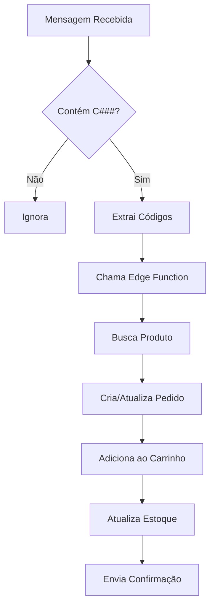

# 🚀 Servidor WhatsApp Multi-Tenant - MANIA DE MULHER

Servidor Node.js para gerenciar múltiplas conexões WhatsApp com detecção automática de códigos de produtos.

## ⚠️ IMPORTANTE: Configuração da Chave

Este servidor precisa da **SERVICE_ROLE_KEY** do Supabase, não da ANON_KEY!

- ❌ **ANON_KEY**: Chave pública (limitada)
- ✅ **SERVICE_ROLE_KEY**: Chave administrativa (necessária)

**Como obter a SERVICE_ROLE_KEY:**
1. Acesse: https://supabase.com/dashboard/project/hxtbsieodbtzgcvvkeqx/settings/api
2. Procure por "service_role" na seção "Project API keys"
3. Copie a chave (é diferente da anon/public key)

## 📋 Funcionalidades

### ✅ Detecção Automática
- Detecta automaticamente códigos `C###` em mensagens e comentários de grupos
- Processa automaticamente vendas quando detecta códigos
- Envia mensagem de confirmação usando template personalizado por tenant

### 📨 Envio de Mensagens
- `/send` - Enviar mensagem individual
- `/send-group` - Enviar mensagem para grupo (SendFlow)
- Suporte a templates personalizados por tenant

### 📊 Gerenciamento
- `/status` - Status de todos os tenants
- `/status/:tenantId` - Status de um tenant específico
- `/list-all-groups` - Listar todos os grupos WhatsApp

## 🔧 Instalação

### 1. Instalar Dependências

```bash
npm install
```

### 2. Configurar SERVICE_ROLE_KEY

**📝 SCRIPT RÁPIDO (Recomendado)**

Edite o arquivo correspondente ao seu sistema:

**Windows** (`start-server.bat`):
```batch
set SUPABASE_SERVICE_ROLE_KEY=COLE_SUA_SERVICE_ROLE_KEY_AQUI
```

**Linux/Mac** (`start-server.sh`):
```bash
export SUPABASE_SERVICE_ROLE_KEY="COLE_SUA_SERVICE_ROLE_KEY_AQUI"
```

Depois execute:
- Windows: `start-server.bat`
- Linux/Mac: `chmod +x start-server.sh && ./start-server.sh`

**💻 LINHA DE COMANDO (Alternativa)**

```bash
# Windows (CMD)
set SUPABASE_SERVICE_ROLE_KEY=sua_service_role_key_aqui
node server1.js

# Windows (PowerShell)
$env:SUPABASE_SERVICE_ROLE_KEY="sua_service_role_key_aqui"
node server1.js

# Linux/Mac
export SUPABASE_SERVICE_ROLE_KEY=sua_service_role_key_aqui
node server1.js
```

### 3. Conectar WhatsApp do MANIA DE MULHER

Quando o servidor iniciar, você verá:

```
📱 Criando cliente WhatsApp para tenant: MANIA DE MULHER (08f2b1b9-3988-489e-8186-c60f0c0b0622)

🔲 QR Code para MANIA DE MULHER:
████ ████ ████ ████ ████
████ ████ ████ ████ ████
...

✅ Servidor rodando na porta 3333
```

**Para conectar:**
1. Abra o WhatsApp do MANIA DE MULHER
2. Vá em **Configurações** → **Aparelhos conectados**
3. Clique em **"Conectar um aparelho"**
4. Escaneie o QR code mostrado no terminal
5. Aguarde a mensagem: `✅ MANIA DE MULHER autenticado!`

**Nota**: O servidor carrega TODOS os tenants ativos automaticamente. Você verá um QR code para cada tenant.

## 🔌 Endpoints da API

### Status Geral
```http
GET http://localhost:3333/status
```

Resposta:
```json
{
  "success": true,
  "tenants": {
    "tenant-id-1": {
      "tenant_name": "MANIA DE MULHER",
      "status": "online",
      "qr": null
    }
  }
}
```

### Listar Grupos
```http
GET http://localhost:3333/list-all-groups
Headers:
  x-tenant-id: tenant-id-aqui
```

Resposta:
```json
{
  "success": true,
  "groups": [
    {
      "id": "120363123456789@g.us",
      "name": "Grupo Vendas",
      "participantCount": 250
    }
  ]
}
```

### Enviar para Grupo (SendFlow)
```http
POST http://localhost:3333/send-group
Headers:
  x-tenant-id: tenant-id-aqui
  Content-Type: application/json

Body:
{
  "groupId": "120363123456789@g.us",
  "message": "🛍️ *VESTIDO AZUL* (C101)\n\n💰 R$ 89,90"
}
```

### Enviar Mensagem Individual
```http
POST http://localhost:3333/send
Headers:
  x-tenant-id: tenant-id-aqui
  Content-Type: application/json

Body:
{
  "phone": "5531999999999",
  "message": "Olá! Seu pedido foi confirmado."
}
```

## 🤖 Detecção Automática de Códigos

O servidor detecta automaticamente quando alguém envia mensagens com códigos de produtos:

### Exemplo:
```
Cliente no grupo: "Quero o C101 e o C205"
```

**O que acontece:**
1. ✅ Servidor detecta os códigos C101 e C205
2. 🔍 Busca produtos no banco de dados
3. 🛒 Cria/atualiza pedido automaticamente
4. 📦 Adiciona itens ao carrinho
5. ⬇️ Decrementa estoque
6. 📱 Envia mensagem de confirmação ao cliente

## 🔄 Fluxo de Processamento



## 🏗️ Arquitetura

- **Node.js**: Gerencia conexões WhatsApp e envia mensagens
- **Edge Functions**: Processa lógica de negócio (vendas, estoque, etc)
- **Supabase**: Armazena dados e templates

### Por que essa arquitetura?

✅ **Separação de Responsabilidades**
- Node.js: Comunicação WhatsApp
- Edge Functions: Lógica de negócio
- Supabase: Persistência de dados

✅ **Escalabilidade**
- Edge Functions escalam automaticamente
- Node.js gerencia apenas conexões

✅ **Manutenibilidade**
- Código organizado e modular
- Fácil adicionar novas funcionalidades

## 🔧 Configuração do Frontend

No arquivo de integração WhatsApp do frontend, configure:

```typescript
api_url: "http://localhost:3333"  // URL do servidor Node.js
```

Para produção (Railway/Heroku):
```typescript
api_url: "https://seu-app.railway.app"
```

## 📝 Logs

O servidor exibe logs detalhados:

```
📨 Mensagem recebida (MANIA DE MULHER): Quero o C101
🔍 Códigos detectados: [ 'C101' ]
👤 Cliente: 5531999999999
🔄 Processando código C101...
✅ Código C101 processado
```

## 🚨 Troubleshooting

### ❌ Erro: "Could not find expected browser (chrome)"

**Solução Rápida:**

1. Execute `instalar-chromium.bat` (Windows) ou `./instalar-chromium.sh` (Linux/Mac)
2. OU certifique-se que o Google Chrome está instalado no Windows

**O servidor agora detecta automaticamente o Chrome do sistema!**

Ver documentação completa: `SOLUCAO_CHROME_WINDOWS.md`

### Problema: QR Code não aparece
**Solução**: Verifique se a porta 3333 está livre e se o Node.js tem permissões

### Problema: "WhatsApp não conectado"
**Solução**: Escaneie o QR Code novamente

### Problema: "tenant_id obrigatório"
**Solução**: Adicione o header `x-tenant-id` nas requisições

### Problema: Códigos não são detectados
**Solução**: Verifique se:
- O formato é C seguido de números (C101, C205)
- O tenant está online
- A edge function está deployada

## 🔐 Segurança

- ✅ Service Role Key armazenada em variável de ambiente
- ✅ Validação de tenant_id em todas as requisições
- ✅ Logs de todas as mensagens enviadas
- ✅ Autenticação persistente local

## 📦 Deploy em Produção

### Railway
```bash
# 1. Criar projeto no Railway
# 2. Conectar repositório
# 3. Adicionar variável de ambiente:
SUPABASE_SERVICE_ROLE_KEY=sua_chave

# 4. Railway detecta automaticamente o start script
```

### Heroku
```bash
heroku create seu-app-whatsapp
heroku config:set SUPABASE_SERVICE_ROLE_KEY=sua_chave
git push heroku main
```

## 📞 Suporte

Em caso de dúvidas:
1. Verifique os logs do servidor
2. Verifique o status dos tenants
3. Consulte a documentação do Supabase
