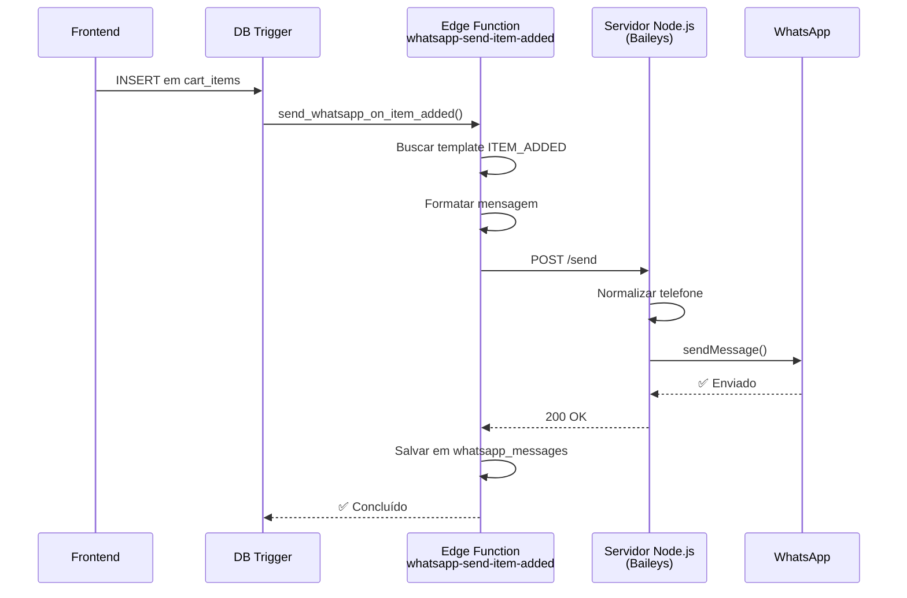

# 🔧 Troubleshooting: WhatsApp não está enviando

## 🔍 Diagnóstico

O sistema funciona assim:

```
Frontend/Backend → Edge Function → Servidor Node.js (Baileys) → WhatsApp
```

Se mensagens não estão sendo enviadas, precisamos verificar **cada etapa**.

## ✅ Checklist Completo

### 1️⃣ Servidor Baileys está rodando?

**Como verificar:**
```bash
# Ver se o servidor está no ar
curl http://localhost:3333/health

# ✅ Resposta esperada:
{"status":"ok","timestamp":"2025-10-13T..."}
```

**Se não responder:**
```bash
# Iniciar o servidor
.\start-baileys.bat

# Ou manualmente:
node server1.js
```

---

### 2️⃣ WhatsApp está conectado?

**Como verificar:**
```bash
# Ver status do WhatsApp
curl http://localhost:3333/status/08f2b1b9-3988-489e-8186-c60f0c0b0622

# ✅ Resposta esperada:
{
  "success": true,
  "tenant_name": "MANIA DE MULHER",
  "status": "online",  ← PRECISA SER "online"!
  "qr_available": false
}
```

**Status possíveis:**
- ❌ `initializing` - Ainda iniciando, aguarde
- ❌ `qr_ready` - QR Code pronto, precisa escanear
- ❌ `connecting` - Conectando, aguarde
- ❌ `disconnected` - Desconectado, veja logs
- ✅ `online` - **PRONTO PARA ENVIAR!**

**Se não estiver online:**
```bash
# Ver o QR Code
http://localhost:3333/qr/08f2b1b9-3988-489e-8186-c60f0c0b0622

# Escanear com WhatsApp do celular
```

---

### 3️⃣ URL do servidor está configurada no Supabase?

O segredo `WHATSAPP_MULTITENANT_URL` precisa estar configurado:

**Valor correto:**
- **Local:** `http://localhost:3333`
- **Produção:** URL pública do servidor (ex: Railway, Heroku)

**Como verificar no código:**
```bash
# As edge functions usam essa URL
WHATSAPP_MULTITENANT_URL → http://localhost:3333
```

⚠️ **IMPORTANTE:** Se você está rodando **local**, o Supabase **NÃO CONSEGUE** acessar `http://localhost:3333` porque localhost é relativo a cada máquina.

**Soluções:**

#### Opção A: Usar ngrok (Recomendado para testes locais)
```bash
# 1. Instalar ngrok: https://ngrok.com/download

# 2. Expor o servidor local
ngrok http 3333

# 3. Copiar a URL gerada (ex: https://abc123.ngrok.io)

# 4. Configurar no Supabase:
WHATSAPP_MULTITENANT_URL = https://abc123.ngrok.io
```

#### Opção B: Deploy em servidor (Recomendado para produção)
```bash
# Fazer deploy do server1.js em:
# - Railway
# - Heroku
# - VPS
# - Render

# Configurar no Supabase:
WHATSAPP_MULTITENANT_URL = https://seu-servidor.railway.app
```

---

### 4️⃣ Testar envio manual

**Teste direto no servidor Node.js:**
```bash
curl -X POST http://localhost:3333/send \
  -H "Content-Type: application/json" \
  -H "x-tenant-id: 08f2b1b9-3988-489e-8186-c60f0c0b0622" \
  -d '{
    "phone": "31999999999",
    "message": "Teste de mensagem"
  }'

# ✅ Resposta esperada:
{
  "success": true,
  "message": "Mensagem enviada com sucesso",
  "phone": "5531999999999@s.whatsapp.net",
  "duration_ms": 1234
}
```

**Se funcionar:** Problema está nas edge functions ou na URL

**Se não funcionar:** Problema está no servidor/WhatsApp

---

### 5️⃣ Ver logs do servidor

**No terminal onde rodou `node server1.js`:**

```
✅ LOGS BOM:
📨 ===== NOVA REQUISIÇÃO DE ENVIO =====
🔑 Tenant ID: 08f2b1b9-3988-489e-8186-c60f0c0b0622
📞 Telefone original: 31999999999
💬 Mensagem (15 chars): Teste de mensagem...
📤 Telefone normalizado: 5531999999999@s.whatsapp.net
⏳ Enviando mensagem via Baileys...
✅ Mensagem enviada com sucesso em 1234ms
```

```
❌ LOGS RUIM:
❌ ERRO: WhatsApp não está ONLINE para tenant 08f2b1b9-3988-489e-8186-c60f0c0b0622
   Status atual: qr_ready
```

---

### 6️⃣ Ver logs das Edge Functions

**No Supabase Dashboard:**
```
Supabase → Functions → whatsapp-send-item-added → Logs
```

**Logs esperados:**
```
🚀 ===== EDGE FUNCTION: ITEM_ADDED =====
📥 Payload recebido: {...}
📤 Telefone final: 5531999999999
💬 Mensagem formatada (120 chars): ...
🌐 Chamando WhatsApp API: http://localhost:3333/send
📦 Payload: {...}
⏱️ Tempo de resposta da API: 1234ms
📊 Status HTTP: 200
✅ Resposta da API: {...}
🎉 ===== ITEM_ADDED CONCLUÍDO =====
```

**Se não tiver logs:** Edge function não está sendo chamada

---

## 🎯 Cenários Comuns

### Cenário 1: Servidor não conecta
```
❌ Erro: Cannot connect to WhatsApp
```

**Solução:**
1. Limpar sessões: `.\limpar-sessao-baileys.bat`
2. Reiniciar: `.\start-baileys.bat`
3. Escanear QR Code novo

---

### Cenário 2: QR Code não aparece
```
⏳ Inicializando... (fica travado)
```

**Solução:**
1. Verificar dependências: `npm install`
2. Verificar se porta 3333 está livre
3. Ver se há erros no console

---

### Cenário 3: Edge Function não consegue conectar
```
❌ WhatsApp API error (500): ECONNREFUSED
```

**Solução:**
1. Servidor não está rodando → `node server1.js`
2. URL errada no Supabase → Corrigir `WHATSAPP_MULTITENANT_URL`
3. Firewall bloqueando → Desabilitar temporariamente

---

### Cenário 4: Mensagem não sai mesmo online
```
Status: online
Mas mensagem não chega
```

**Solução:**
1. Verificar se o telefone está correto
2. Ver logs do servidor: há erro de envio?
3. Testar envio manual (curl acima)
4. Verificar se WhatsApp do celular está funcionando

---

## 📊 Fluxo Completo de Envio

### Quando um item é adicionado ao carrinho:



### Onde pode falhar?

1. **Trigger não dispara** → Ver `supabase/migrations`
2. **Edge Function não roda** → Ver logs no Supabase
3. **Edge Function não alcança servidor** → URL errada ou servidor offline
4. **Servidor não envia** → WhatsApp não conectado ou erro no Baileys
5. **WhatsApp não entrega** → Telefone inválido ou bloqueado

---

## 🔧 Comandos Úteis

```bash
# Status do servidor
curl http://localhost:3333/status

# Status do tenant
curl http://localhost:3333/status/08f2b1b9-3988-489e-8186-c60f0c0b0622

# Enviar teste
curl -X POST http://localhost:3333/send \
  -H "Content-Type: application/json" \
  -H "x-tenant-id: 08f2b1b9-3988-489e-8186-c60f0c0b0622" \
  -d '{"phone":"31999999999","message":"Teste"}'

# Listar grupos
curl "http://localhost:3333/list-all-groups?tenant_id=08f2b1b9-3988-489e-8186-c60f0c0b0622"

# Ver QR Code
http://localhost:3333/qr/08f2b1b9-3988-489e-8186-c60f0c0b0622
```

---

## ✅ Checklist Final

Antes de dizer que "não está funcionando", verifique:

- [ ] Servidor Node.js está rodando (`curl http://localhost:3333/health`)
- [ ] WhatsApp está online (`status: "online"`)
- [ ] WHATSAPP_MULTITENANT_URL está configurado
- [ ] Se local, está usando ngrok ou túnel
- [ ] Trigger `send_whatsapp_on_item_added` existe e está ativo
- [ ] Edge function `whatsapp-send-item-added` existe
- [ ] Template `ITEM_ADDED` existe no banco para o tenant
- [ ] Telefone do cliente está correto (formato: 31999999999)
- [ ] Porta 3333 não está bloqueada por firewall

---

## 🆘 Ainda não funciona?

Execute este script de diagnóstico completo:

```bash
echo "=== DIAGNÓSTICO COMPLETO ==="
echo ""
echo "1. Servidor:"
curl -s http://localhost:3333/health || echo "❌ Servidor OFFLINE"
echo ""
echo "2. Status WhatsApp:"
curl -s http://localhost:3333/status/08f2b1b9-3988-489e-8186-c60f0c0b0622 | grep -o '"status":"[^"]*"'
echo ""
echo "3. Teste de envio:"
curl -s -X POST http://localhost:3333/send \
  -H "Content-Type: application/json" \
  -H "x-tenant-id: 08f2b1b9-3988-489e-8186-c60f0c0b0622" \
  -d '{"phone":"31999999999","message":"Teste"}'
echo ""
echo "=== FIM DO DIAGNÓSTICO ==="
```

**Copie a saída** e me envie para análise detalhada.
